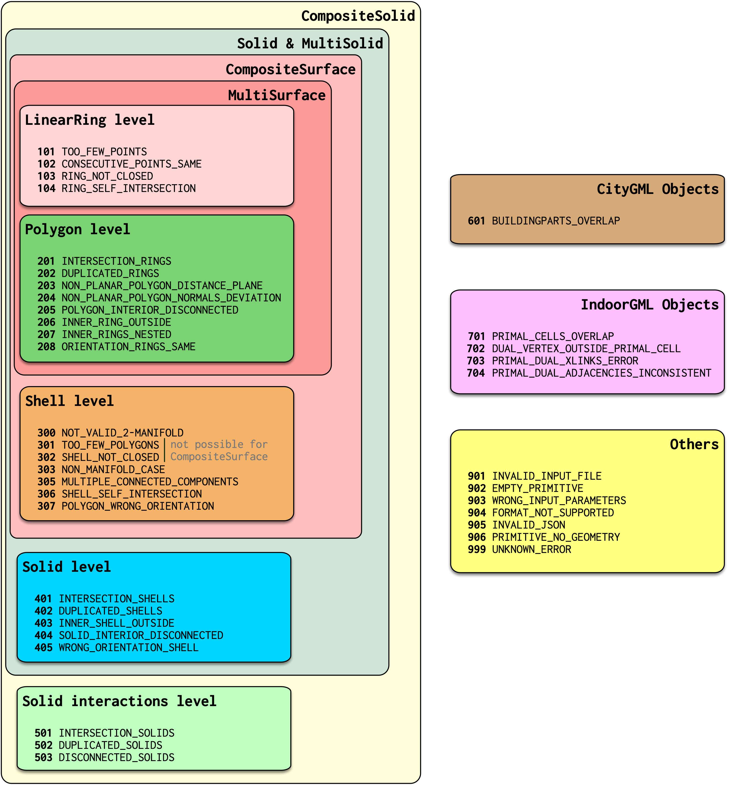

   

# val3dity

val3dity---pronounced 'val-three-dity'---allows us to validate 3D primitives according to the international standard ISO19107.
Think of it as [PostGIS ST_IsValid](http://postgis.net/docs/ST_IsValid.html), but for 3D primitives (PostGIS only validates 2D primitives).

In short, it verifies whether a 3D primitive respects the definition as given in [ISO19107](http://www.iso.org/iso/catalogue_detail.htm?csnumber=26012) and [GML](https://en.wikipedia.org/wiki/Geography_Markup_Language).

The validation of the following 3D primitives is fully supported:

  - ``MultiSurface``
  - ``CompositeSurface`` 
  - ``Solid``
  - ``MultiSolid``
  - ``CompositeSolid``

Unlike many other validation tools in 3D GIS, inner rings in polygons/surfaces are supported and so are cavities in solids (also called voids or inner shells).
However, as is the case for many formats used in practice, only planar and linear primitives are allowed: no curves or spheres or other parametrically-modelled primitives are supported. 
There is no plan to support these geometries.

val3dity accepts as input:

  - [CityJSON](http://www.cityjson.org)
  - [tu3djson](https://github.com/tudelft3d/tu3djson)
  - [OBJ](https://en.wikipedia.org/wiki/Wavefront_.obj_file)
  - [OFF](https://en.wikipedia.org/wiki/OFF_(file_format))
  - [IndoorGML](http://indoorgml.net/)

For the CityJSON and IndoorGML formats, extra validations are performed (specific to the format), eg the overlap between different parts of a building, or the validation of the navigation graph in IndoorGML.

## Usage

val3dity is a command-line interface (CLI) programme only, with [several options](https://val3dity.readthedocs.io/en/latest/usage/#options-for-the-validation).

  
_No demo visible here? View it on [asciinema](https://asciinema.org/a/329835)._

## Web application

If you don't want to go through the troubles of compiling and/or installing val3dity, we suggest you use the [web application](http://geovalidation.bk.tudelft.nl/val3dity).
Simply upload your file to our server and get a validation report back.
We delete the file as soon as it has been validated (promised!).
However, a file is limited to 50MB.

## Installation of the command-line tool

### macOS

The simplest, if you have [Homebrew](http://brew.sh/), is:

    $ brew tap tudelft3d/software
    $ brew install val3dity

You can also get the code, and compile it yourself.
You first need to install the following free libraries:

  1. [CGAL v5.0+](http://www.cgal.org) 
  1. [Eigen library](http://eigen.tuxfamily.org)
  1. [GEOS](http://trac.osgeo.org/geos/)
  1. [CMake](http://www.cmake.org)

Under macOS, it's super easy, we suggest using [Homebrew](http://brew.sh/):

    $ brew install cgal
    $ brew install eigen
    $ brew install geos
    $ brew install cmake

and then

    $ mkdir build
    $ cd build
    $ cmake ..
    $ make

### linux

Under Linux (at least Ubuntu), CGAL has to be compiled because apt-get doesn't give you a version with Eigen.
Thus, in a nutshell,

  1. install Eigen library: `$ sudo apt install libeigen3-dev`
  1. install GEOS library: `$ sudo apt install libgeos++-dev`
  1. install CGAL: `$ sudo apt-get install libcgal-dev`
    - if it's not CGAL5 that is installed, download [latest CGAL code](https://github.com/CGAL/cgal/releases) and unzip somewhere
    - set `CGAL_DIR` to that folder, eg `export CGAL_DIR=/home/hledoux/software/CGAL-5.0.2`, this will tell your shell to use that version of CGAL (thus more version of CGAL can be installed on the same computer; see that [handy manual](https://github.com/CGAL/cgal/wiki/Branch-Build))

### Windows

For Windows, we offer [an executable](https://github.com/tudelft3d/val3dity/releases).

It's also possible to compile val3dity yourself with the CMake file we offer, but it's slightly more complex with the dependencies.
We suggest you look at [how we build it on GitHub Actions](https://github.com/tudelft3d/val3dity/blob/main/.github/workflows/exe_build.yml) to get some inspirate (and help).

## Usage
To compile and run val3dity (from the val3dity folder):

    $ ./val3dity /data/cityjson/cube.json

The summary of the validation is reported, and you should see that `cube.json` contains one valid primitive.

Finally, to see all the options possible:

    $ ./val3dity --help

## Using val3dity as a library

val3dity can be compiled as a library:

    $ cmake .. -DLIBRARY=true

There is a simple example of how to use it in `./demo_lib` with instructions to compile it.

## Unit tests

To verify that everything went fine during the compilation, run the unit tests (from the root folder of val3dity) (this requires `pip install pytest pyyaml`):

    $ python -m pytest --runfull

You shouldn't get any errors.

## Usage of Docker

To run val3dity over Docker simply execute:

    $ docker run --rm  -v <local path where your files are>:/data tudelft3d/val3dity:<tag> <name of the dedicated file>
    
Where `<tag>` is docker image tag from [https://hub.docker.com/r/tudelft3d/val3dity/tags](https://hub.docker.com/r/tudelft3d/val3dity/tags)

If you are using the `--report` option, then **keep in mind that `<local path where your files are>` need to be writable by any user, otherwise your output won't be saved.**

## Documentation and help

Read the full documentation at [https://val3dity.rtfd.io](https://val3dity.rtfd.io).

The primary channel to communicate with the developers is the Issues section.

If you have a question or came across a bug, please submit an issue there.
However we ask you check first whether your problem has already been solved by someone else.

## If you use val3dity in a scientific context, please cite these articles:

Ledoux, Hugo (2019). val3dity: validation of 3D GIS primitives according to the international standards. *Open Geospatial Data, Software and Standards*, 3(1), 2018, pp.1 [[PDF](https://opengeospatialdata.springeropen.com/track/pdf/10.1186/s40965-018-0043-x.pdf)] [[DOI](http://dx.doi.org/10.1186/s40965-018-0043-x)]

Ledoux, Hugo (2013). On the validation of solids represented with the international standards for geographic information. Computer-Aided Civil and Infrastructure Engineering, 28(9):693-706. [[PDF](https://3d.bk.tudelft.nl/hledoux/pdfs/13_cacaie.pdf)] [[DOI](http://dx.doi.org/10.1111/mice.12043)]

## Error codes

